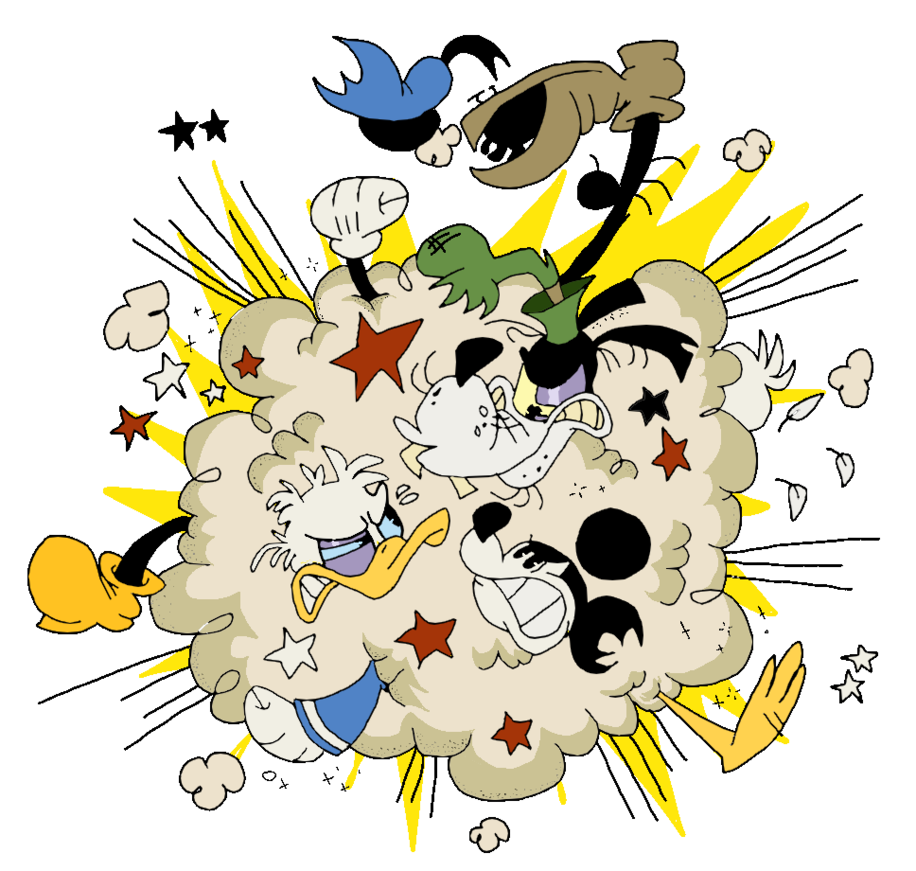
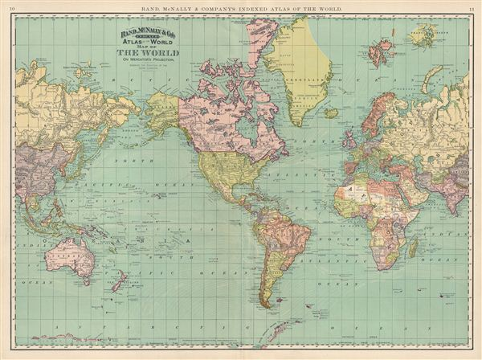
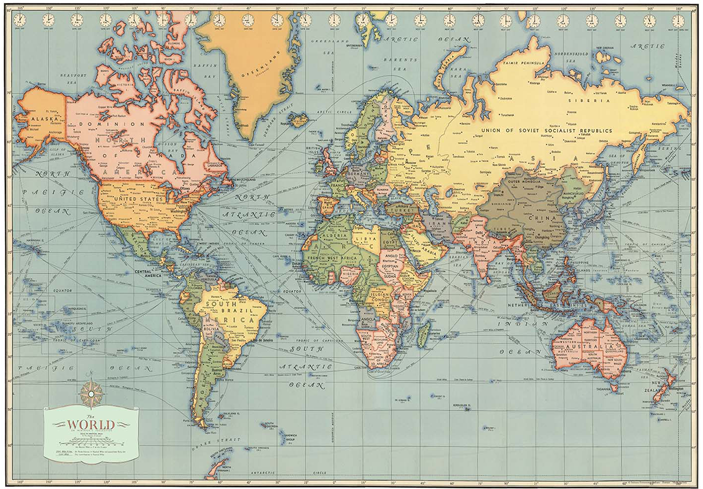
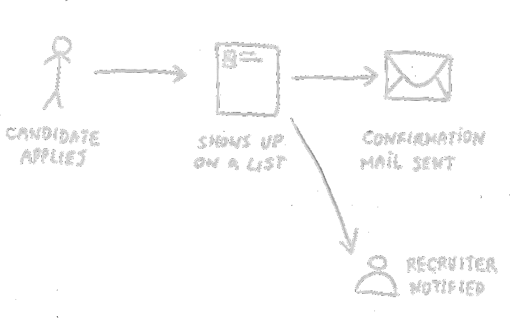

footer: © SmartRecruiters Inc, 2018

## CARTOGRAPHY 101

---

# Domain driven design

### Why should I care?

---

# Complexity of the system

Cs >= Cd

^ [TC] Every system has complexity. Complexity of system at least as domain. 
Domain plus something

---

# Complexity of the system

Cs ≈ Cd * (1 + ∂)

^ [TC] Math notation. Delta is the accidential complexity.

---

### Complexity of software =

### *ESSENTIAL* + ACCIDENTAL

^ In other words...
Essential: part of the domain

---

### Complexity of software =

### ESSENTIAL + *ACCIDENTAL*

^ ACCIDENTAL: brought by devs

---

^ Imagine a software:
First version. 
Built fast and it's working.

---

^ Without care and consideration, we build on top and software turns into BBOM.

---

^ [TC] It works, but no one knows why. Change is risky and difficult. Developers spend time on technical complexity.

---

^[MG] Complexity kills
- innovation
- growth
- whole businesses

—--

^[MG] We could randomly fight complexity, or... 

---

### Identify 
# critical core 
### of the business

^[MG] We could take a step back
- And think where and how to tackle complexity

---

### Money, money, 
# money

^[MG] It’s all about the money 

---

# Competitive Advantage

^[MG] Where would the improvements be most beneficial?

---

# Core Domain

^[MG] This critical part of the business is the core domain

---

# Supportive Domains

^[MG] domain

---

# Generic Domains

^[MG] Not business specific
- Subdomains which do not give us competetive adventage can be replaced with third party solutions

---

## Stay in the
# Problem Space

^[MG] Deeply analyse the problem space before moving on to solution space
- Truly understand the essence of the obstacles

---

# MODEL

^ [TC] Database? UML Diagram?

——

# “The purpose of models is not to fit the data but to sharpen the questions.” 
# — Sam Karlin 
* Born: 1924 in Janów, Poland
* Died: 2007 in Palo Alto, California, USA

---

^ What's wrong with this map? 
USA in the center. 

---

^ Globe on planar surface -> introduce distortion.
Mercator projection.
Preserve direction. Distort area. Useful for navigation.

---

^ Make america great by moving close to Russia. Badam-tss.

---

# Mercator's Model

- Globe is a sphere
- Coordinates on surface
- Mercator's projection

^ Abstraction. 
- SURFACE is important.
Data selection: coastlnes, ports and not much more.
Choose one that asserts: preserved direction - choose MERCATOR.  
! Elevation is optional. We leave out a lot.
Map is USEFUL.

---

## Model

### Not realistic

^ We aren't looking for description of reality.
Is the map realistic picture of Earth?

---

# Model

## Serves some use, specific to a particular scenario

> Essentially, all models are wrong, but some are useful
-- George Box

^ There's never only one valid model. Can evolve.

---

## Model

### Common ground of Business & Tech

^ Result of conversation modeller with domain expert.

---

---

---

### Maps are easy.
# How to build domain model?

^[KS] 
- its an experiment.
- month ago we havent good tool. We had blurry idea how to start modeling domain. 

---

![inline] (ddd/ship.jpg)

^[KS]
- During DDDEU Stefan Hofer and Henning Schwentner presented Storytelling technique based on example of a software which helps manuver ships over river Elbe on their way to Hamburg. 

---

# Domain Storytelling. How does this work?

![inline] (ddd/example_story_model.png)

^[KS] 
- interviews with domain experts, 
- recording stories as a diagram, drawing it using symbols
- feedback on recorded model

---

## ”Three good examples are better than a bad abstraction."
####Peter Hruschka in Business Analysis und Requirements Engineering

^[KS]
- Focus on single scenario. 
- keep concepts explicit
- Avoid distractions to consider multiple scenarios

---

# Focus

^[KS]
Company from 80's
Visa
Single Scenario 
Open mind
Forget about our system - we want create something not influenced by possible bad decisions from past

---

# Moderators

^[KS]
ask questions
draw model

---

# Model
 

^[KS] 
- technique set of simple rules and symbols
- there is no symbol for conditions and parallelism

---

# Feedback

^[KS]
validate model
let us know if you do not agree with it

---

# Nothing beats a good story

^[MG]
- Summarise our story: The Hiring Story
- It’s the primary scenario from our core domain: connecting candidate with a job
- Mention that The Hiring Story can be told either from employer end (looking for worker) or from candidate end (looking for a job)
- We focus on the use case that starts on employer end

---

![inline] (ddd/whats_your_story.jpg)

^[ALL] lets draw story as a diagram without any boundaries

---

# Why do we care about Bounded Contexts?

^[KS] 
* accidental complexity, software becomes model of a business.
* limit software changes
* Splits complex problem domain to smaller one.
* Its easier to define impact on the system
* Single responsibility of context. Subdomain should not cross boundaries of bounded context
* Do not share bounded contexts between teams
* Allows to organize technical module boundaries inside subdomain which doesnt change often (if properly defined).

---

# How to identify bounded contexts
Indicators of boundary:

* one way information flow
* difference in language
* different triggers

^[All] Say how to do this and try to draw boundaries

---

