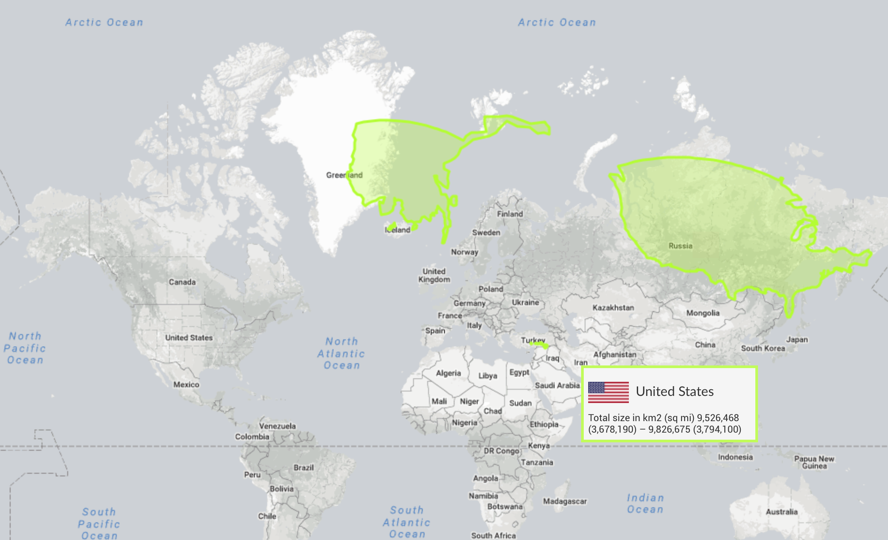
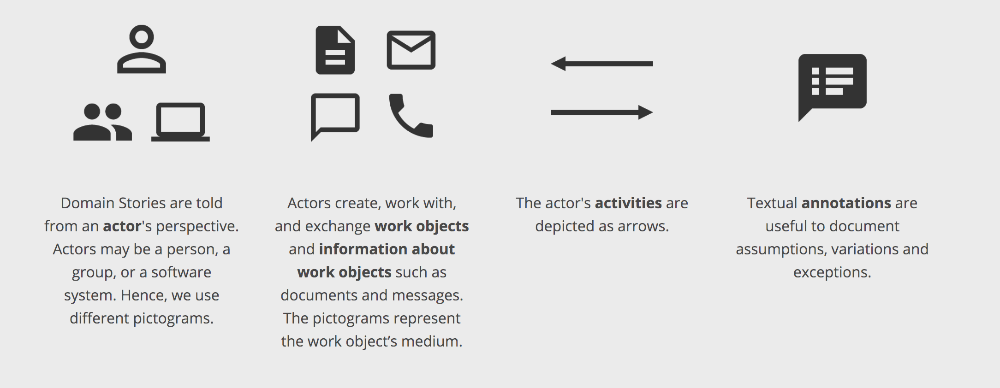

footer: © SmartRecruiters Inc, 2018

## CARTOGRAPHY 101

---

# Domain driven design

### Why should I care?

---

### Complexity of software =

### *ESSENTIAL* + ACCIDENTAL

---

### Complexity of software =

### ESSENTIAL + *ACCIDENTAL*

---

^ Initial commit. Built fast and it's working.

---

^ Without care and consideration, we build on top and software turns into BBOM.

---

^ [TC] It works, but no one knows why. Change is risky and difficult. Developers spend time on technical complexity.

---

# MODEL

---

---

---
# Maps are easy. 
# How to build domain model?

^[KS] 
- its an experiment.
- month ago we havent good tool. We had blurry idea how to start modeling domain. 

---

![inline] (ddd/ship.jpg)

^[KS]
- During DDDEU Stefan Hofer and Henning Schwentner presented Storytelling technique based on example of a software which helps manuver ships over river Elbe on their way to Hamburg. 

---

# Domain Storytelling. How does this work?

![inline] (ddd/example_story_model.png)

^[KS] 
- interviews with domain experts, 
- recording stories as a diagram, drawing it using symbols
- feedback on recorded model

---
# "Three good examples are better than a bad abstraction."
####Peter Hruschka in Business Analysis und Requirements Engineering

^[KS]
- Focus on single scenario. 
- keep concepts explicit
- Avoid distractions to consider multiple scenarios

---

# Focus

^[KS]
Company from 80's
Single Scenario 
Open mind
Forget about our system - we want create something not influenced by possible bad decisions from past

---

# Moderators

^[KS]
ask questions
draw model

---
# Model
 

^[KS] 
- technique set of simple rules and symbols
- there is no symbol for conditions and parallelism

---

# Feedback

^[KS]
validate model
let us know if you do not agree with it

---

![inline] (ddd/whats_your_story.jpg)

^[ALL] lets draw story as a diagram without any boundaries

---

# Why we care about bounded contexts?

^[KS] 
* accidental complexity, software becomes model of a business.
* limit software changes
* Splits complex problem domain to smaller one.
* Its easier to define impact on the system
* Single responsibility of context. Subdomain should not cross boundaries of bounded context
* Do not share bounded contexts between teams
* Allows to organize technical module boundaries inside subdomain which doesnt change often (if properly defined).

---
# How to identify bounded contexts
Indicators of boundary:

* one way information flow
* difference in language
* different triggers

^[All] Say how to do this and try to draw boundaries

---

